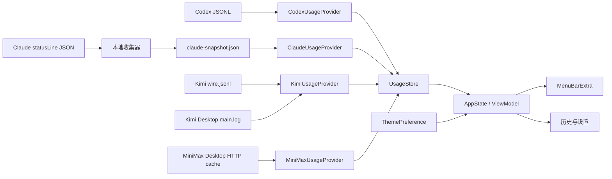
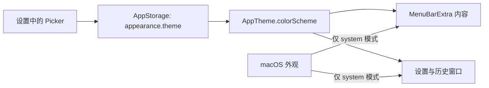

# 架构文档

## 1. 架构目标

架构围绕三个约束设计：数据格式可能变化、应用需要低资源常驻、任何会话正文都不应进入持久化层。



## 2. 模块边界

### App

负责应用生命周期、菜单栏 scene、设置窗口和依赖装配。

### Models

只包含与来源无关的领域模型。界面不得直接依赖原始 JSON 字段。

```swift
enum ProviderID: String, Codable, Sendable {
    case codex
    case claudeCode
    case kimiCode
    case miniMax
}

struct RateLimitWindow: Codable, Sendable {
    let kind: WindowKind
    let usedPercentage: Double
    let resetsAt: Date
    let durationMinutes: Int?
}

struct TokenUsage: Codable, Sendable {
    let input: Int
    let cachedInput: Int
    let output: Int
    let reasoningOutput: Int
}

struct UsageSnapshot: Codable, Sendable {
    let provider: ProviderID
    let windows: [RateLimitWindow]
    let tokens: TokenUsage?
    let estimatedCostUSD: Decimal?
    let observedAt: Date
    let sourceVersion: String?
}
```

### Providers

每个来源实现同一个协议，并把格式变化限制在自己的模块内。

```swift
protocol UsageProvider: Sendable {
    var id: ProviderID { get }
    func detect() async -> ProviderAvailability
    func latestSnapshot() async throws -> UsageSnapshot?
    func updates() -> AsyncStream<ProviderUpdate>
}
```

### Parsing

- 使用小型 `Decodable` 结构，只声明允许读取的字段。
- 未知字段自动忽略。
- 缺少可选字段时返回部分结果。
- 百分比统一限制在 `0...100`。
- Unix 秒与 ISO 8601 时间在 provider 边界转换成 `Date`。

### UsageStore

职责：

- 保存每个提供商的最新快照。
- 按日期和提供商维护 token 增量。
- 记录文件 inode/路径、读取偏移量及最后事件标识，防止重复累计。
- 向界面发布不可变状态。

建议首版使用 JSON 或 plist 保存小型聚合索引；需要复杂历史查询后再迁移 SwiftData/SQLite。

### ThemePreference

主题是纯本地用户偏好，与用量数据分离。使用稳定的字符串值持久化，避免枚举顺序变化导致设置失效。

```swift
enum AppTheme: String, CaseIterable, Codable, Sendable {
    case system
    case light
    case dark

    var colorScheme: ColorScheme? {
        switch self {
        case .system: nil
        case .light: .light
        case .dark: .dark
        }
    }
}
```

通过 `@AppStorage("appearance.theme")` 保存选择。`.system` 映射为 `nil`，使 SwiftUI 继续继承 macOS 当前外观；浅色和深色分别映射为显式 `ColorScheme`。

## 3. Codex 数据流

数据发现路径：

```text
~/.codex/sessions/**/*.jsonl
~/.codex/archived_sessions/*.jsonl
```

只解析 `type == "event_msg"` 且 `payload.type == "token_count"` 的记录。当前观察到的重要字段：

```text
payload.info.last_token_usage.*
payload.info.total_token_usage.*
payload.info.model_context_window
payload.rate_limits.primary.*
payload.rate_limits.secondary.*
```

### 去重策略

`total_token_usage` 是会话累计值，不能把每一行直接相加。对每个会话保存上次累计值，新事件只计入非负差值：

```text
delta = max(currentSessionTotal - previousSessionTotal, 0)
```

文件被截断、轮转或会话累计值下降时，把它识别为新序列；根据会话标识和事件时间避免重复。

## 4. Claude Code 数据流

Claude Code 官方 status line 会将用量 JSON 写入命令的标准输入。收集器应：

1. 从标准输入完整读取一份 JSON。
2. 仅提取允许字段。
3. 原子写入 `~/Library/Application Support/AI Usage/claude-snapshot.json`。
4. 如果用户原来配置了 status line，把同一份输入继续传给原命令并返回其输出。

关键字段：

```text
rate_limits.five_hour.used_percentage
rate_limits.five_hour.resets_at
rate_limits.seven_day.used_percentage
rate_limits.seven_day.resets_at
context_window.current_usage.*
context_window.used_percentage
cost.total_cost_usd
session_id
version
```

`rate_limits` 仅对符合条件的 Claude.ai 订阅会话出现，并且通常要等待第一次 API 响应。provider 必须把字段缺失视为“等待数据”，不能当作 0%。

Claude Desktop 的 `plan-usage-history.json` 保存 5 小时与 7 天用量历史，但不总是包含重置时间。provider 优先使用 status line 中仍有效的官方 `resets_at`；缺失时，根据 Desktop 历史里用量从 0 变为正数或周期重置后回落的最近时间，分别推断 5 小时与 7 天窗口边界，避免已有用量时持续显示“重置时间未知”。

## 5. Kimi Code 数据流

Kimi Code 会话默认位于 `~/.kimi-code/sessions`，也支持通过 `KIMI_CODE_HOME` 更改根目录。每个主代理和子代理分别保存 `agents/<id>/wire.jsonl`。

provider 只处理 `usage.record` 事件中的以下字段：

```text
time
usage.inputOther
usage.inputCacheRead
usage.inputCacheCreation
usage.output
```

输入 Token 为 `inputOther + inputCacheRead + inputCacheCreation`，其中两类缓存 Token 是输入的子集，不会在总 Token 中重复相加。旧版 `StatusUpdate.payload.token_usage` 按 `message_id` 保留最新累计值，避免重复统计。

Kimi Desktop 的 `~/Library/Logs/kimi-desktop/main.log` 包含 `SubscriptionManager` 输出的 `omniRatio` 与 `resetAt`。provider 从日志尾部增量读取最新记录，把比例展示为“订阅总额度”。其中 `resetAt` 是订阅额度的到期日期，并非精确的滚动窗口时刻，因此界面只显示日期，避免将 UTC 午夜换算出的本地时刻误认为官方刷新时间。

Kimi Code 的 5 小时与每周额度来自官方 `https://api.kimi.com/coding/v1/usages`。用户必须主动在设置中配置 API Key，凭证只写入 macOS 钥匙串；应用不读取 Kimi Desktop Cookie 或内部令牌。接口顶层 `usage` 映射为每周额度，`limits` 中 `duration == 300` 且单位为分钟的窗口映射为 5 小时额度。该远程额度与本地 Token、Desktop 订阅总额度是独立指标；`conversation-context-usage.json` 只是上下文快照，不能作为每日 Token 汇总，因此不读取。

## 6. MiniMax 数据流

MiniMax Desktop 会把订阅额度接口的响应写入 Chromium HTTP 缓存：

```text
~/Library/Application Support/MiniMax/Cache/Cache_Data/*
```

缓存文件名是 Chromium 生成的哈希值，不能依赖固定文件名。`MiniMaxUsageProvider` 扫描目录中的普通文件，根据修改时间优先处理新文件，在二进制缓存中定位完整的 JSON 对象，并且只解码以下字段：

```text
model_remains[].model_name
model_remains[].current_interval_remaining_percent
model_remains[].start_time
model_remains[].end_time
model_remains[].current_weekly_remaining_percent
model_remains[].weekly_start_time
model_remains[].weekly_end_time
```

provider 选择 `model_name == "general"` 的记录作为编程/文本订阅额度。界面中的已用百分比由官方剩余百分比转换：

```text
used = clamp(100 - remaining, 0, 100)
```

`end_time` 是 5 小时窗口重置时间，`weekly_end_time` 是本周窗口重置时间。该 Desktop 缓存是 MiniMax 的唯一事实源：不扫描 `~/.claude/projects` 或 `~/.claude-minimax`，不读取可能含凭证的 API 日志，也不通过本地 Token 或订阅计划反推额度。缓存不包含可靠的逐日 Token 历史，因此 MiniMax 不生成 `dailyUsage`，历史页也不展示 MiniMax Token 图表。

MiniMax API 授权与上述用量采集相互独立。用户选择中国大陆或海外区域后，API Key 写入 macOS 钥匙串；应用分别请求官方 `https://api.minimaxi.com/v1/models` 或 `https://api.minimax.io/v1/models`，以 Bearer 授权验证 Key 并解码返回的模型数量。验证请求不生成内容，Key 不写入 `UserDefaults` 或日志。当前没有公开的历史 Token 聚合接口，因此授权成功不会改变 MiniMax 的 `dailyUsage`。

模型显示优先级保存在 `UserDefaults` 的 `providers.order` 中。详情卡片通过应用内 `DragGesture` 跟踪指针与卡片坐标，绕开 `MenuBarExtra(.window)` 中不稳定的系统文件拖放会话；菜单栏多模型视图、历史页和设置页读取同一顺序。恢复设置时会去除无效项和重复项，并把新版本新增的 provider 自动追加到末尾。

## 7. 文件监听

- 启动时执行一次受限扫描。
- 运行期间使用 FSEvents 或目录级文件事件监听。
- 事件触发后进行约 300 ms debounce，合并连续写入。
- 每 60 秒检查一次文件修改时间作为兜底，而非重新解析全部内容。
- 单文件按 byte offset 增量读取；只保留最后不完整的一行等待下次拼接。
- 文件 I/O 与解析在独立 actor 中完成，UI 更新回到 MainActor。

## 8. 错误模型

```swift
enum ProviderAvailability: Equatable, Sendable {
    case ready(lastUpdated: Date)
    case waitingForFirstSample
    case cliNotInstalled
    case integrationNotInstalled
    case permissionDenied
    case unsupportedFormat(version: String?)
    case stale(lastUpdated: Date)
}
```

界面永远显示上次有效值，并单独标注其新鲜度。一次损坏行只产生诊断事件，不应清空已有数据。

## 9. 配置与权限

### 首版分发

建议首个 beta 采用 Developer ID 签名、公证、非 Mac App Store 分发。这样可以在用户明确同意后读取隐藏目录，同时避免沙盒目录授权给首次配置带来的复杂度。

### 沙盒版本

如果后续进入 Mac App Store：

- 使用 `NSOpenPanel` 让用户分别选择 `.codex` 和 `.claude`。
- 保存 security-scoped bookmark。
- 每次访问前解析 bookmark，并处理 stale bookmark。

## 10. 安全边界

明确禁止读取：

```text
~/.codex/auth.json
任何 API key 环境变量
浏览器 Cookie 与 Keychain 登录项
提示词、助手回答、工具调用正文
```

日志中不得记录原始 JSON 行。诊断信息只包含 provider、应用版本、CLI 版本、错误类型和去标识后的字段路径。

## 11. 可测试性

- provider 初始化时注入根目录，不在实现中写死用户 home。
- 所有测试使用 `Tests/Fixtures` 下的匿名 JSONL。
- 使用可注入 Clock 验证重置倒计时和跨日聚合。
- 对日志追加、半行写入、文件轮转、重复事件、未知字段和损坏行分别建立测试。

## 12. 兼容性策略

- 原始解析结构包含 `sourceVersion`，方便按 CLI 版本定位问题。
- 允许字段新增，不要求完整 schema 匹配。
- 关键字段重命名时显示“格式不支持”，绝不猜测百分比。
- 发布前至少验证当前版本和一个旧版本 fixture。

## 13. 主题传播



- 所有应用窗口读取同一个主题偏好，避免弹窗和设置页不同步。
- 菜单栏 label 使用 SF Symbol 或 template image，让系统自行适配菜单栏背景；不对 label 强制前景色。
- 组件使用 `Color.primary`、`Color.secondary`、系统材料和语义色，不把浅色原型的固定颜色直接用于深色模式。
- 在主题变化时不重建 provider 或中断文件监听；主题只影响视图层。
