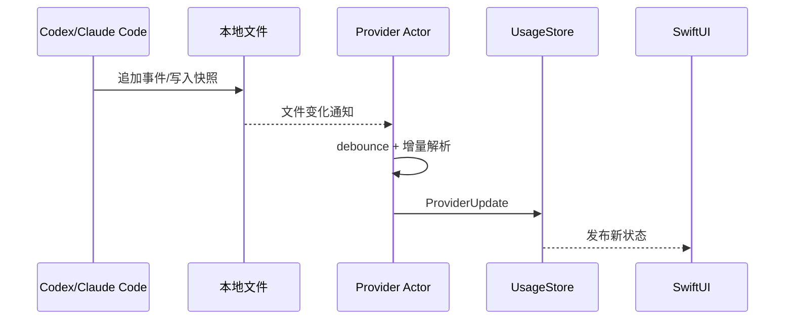

# 开发文档

## 1. 技术选择

| 项目 | 选择 | 原因 |
| --- | --- | --- |
| UI | SwiftUI | 原生菜单栏与设置窗口，较低常驻开销 |
| 菜单栏 | `MenuBarExtra` + `.window` | 适合信息密度较高的弹窗 |
| 最低系统 | macOS 13 | `MenuBarExtra` 的可用基线 |
| 并发 | Swift Concurrency | actor 隔离文件状态，AsyncStream 推送更新 |
| 解析 | Foundation `JSONDecoder` | 无额外运行时依赖，支持忽略未知字段 |
| 缓存 | JSON/plist，后续可迁移 SwiftData | MVP 数据量小且便于诊断 |
| 主题 | `AppStorage` + `preferredColorScheme` | 三态切换简单、即时且可持久化 |
| 测试 | Swift Testing 或 XCTest | fixture 驱动，不读取真实用户数据 |

参考资料：

- [Apple MenuBarExtra](https://developer.apple.com/documentation/swiftui/menubarextra)
- [Claude Code status line](https://code.claude.com/docs/en/statusline)
- [Claude Code usage monitoring](https://code.claude.com/docs/en/monitoring-usage)
- [OpenAI Codex plan usage](https://help.openai.com/en/articles/11369540-using-codex-with-your-chatgpt-plan)

## 2. 工程初始化

在 Xcode 中创建：

```text
Template: App
Product Name: AIUsage
Interface: SwiftUI
Language: Swift
Testing System: Swift Testing
Minimum Deployment: macOS 13.0
```

推荐 targets：

```text
AIUsage                  主菜单栏应用
AIUsageCore              可选 Swift Package，领域模型和 provider
AIUsageTests             单元测试
AIUsageUITests           菜单栏和设置页烟雾测试
claude-usage-collector   小型命令行 helper
```

主应用 `Info.plist` 设置 `LSUIElement = YES`，避免显示 Dock 图标。若同时提供普通设置窗口，需验证菜单栏 scene 被用户移除时的生命周期行为。

## 3. 实现顺序

### 第一步：菜单栏骨架

创建 `MenuBarExtra`、`AppState` 和静态 provider 卡片。先使用 fixture 数据完成浅色、深色、空状态和错误状态，再连接真实文件。

```swift
@main
struct AIUsageApp: App {
    @StateObject private var state = AppState()
    @AppStorage("appearance.theme") private var theme = AppTheme.system.rawValue

    private var selectedTheme: AppTheme {
        AppTheme(rawValue: theme) ?? .system
    }

    var body: some Scene {
        MenuBarExtra {
            MenuBarView()
                .environmentObject(state)
                .frame(width: 360)
                .preferredColorScheme(selectedTheme.colorScheme)
        } label: {
            Label(state.menuBarText, systemImage: "gauge.with.dots.needle.67percent")
        }
        .menuBarExtraStyle(.window)

        Settings {
            SettingsView()
                .environmentObject(state)
                .preferredColorScheme(selectedTheme.colorScheme)
        }
    }
}
```

主题值定义为稳定字符串：

```swift
enum AppTheme: String, CaseIterable, Identifiable {
    case system
    case light
    case dark

    var id: Self { self }

    var title: LocalizedStringKey {
        switch self {
        case .system: "跟随系统"
        case .light: "浅色"
        case .dark: "深色"
        }
    }

    var colorScheme: ColorScheme? {
        switch self {
        case .system: nil
        case .light: .light
        case .dark: .dark
        }
    }
}
```

### 第二步：Codex provider

1. 检测 `codex` 可执行文件与数据目录。
2. 枚举 sessions 与 archived_sessions 中的 JSONL。
3. 从文件尾部寻找最新 `token_count`，建立初始额度快照。
4. 扫描历史事件并按会话累计差值生成每日 token 汇总。
5. 保存每个文件的读取偏移和会话累计值。
6. 启用目录监听，只处理追加内容。

建议采用宽容解码：

```swift
struct CodexEnvelope: Decodable {
    let type: String
    let timestamp: Date?
    let payload: Payload?

    struct Payload: Decodable {
        let type: String?
        let info: TokenInfo?
        let rateLimits: RateLimits?

        enum CodingKeys: String, CodingKey {
            case type, info
            case rateLimits = "rate_limits"
        }
    }
}
```

禁止将整行 JSON 解码成通用字典后写入缓存，这会增加意外保存会话正文的风险。

### 第三步：Claude collector

Claude Code 的 status line 是最稳定的实时数据出口。helper 从 stdin 接收 JSON，仅输出白名单字段到快照文件。

原子写入流程：

```text
写入 claude-snapshot.json.tmp
fsync/关闭文件
rename 为 claude-snapshot.json
```

集成安装器需要：

1. 读取 `~/.claude/settings.json`。
2. 如果存在 `statusLine`，把原设置序列化保存到应用自己的配置中。
3. 安装包装命令，而不是直接丢弃原命令。
4. 更新设置时保留所有未知键。
5. 卸载时只在当前值仍属于本应用时恢复备份，避免覆盖用户后续修改。

collector 执行必须足够快，目标低于 50 ms，且失败时不得影响 Claude Code 原 status line。

### 第四步：聚合与持久化

每日统计键：

```text
local-calendar-day + provider + model(optional)
```

事件时间以 UTC `Date` 存储，分桶时使用用户当前日历和时区。如果系统时区改变，保留已落盘日桶，不静默重算历史。

额度快照只保存最新有效值和观察时间；历史图可按固定间隔采样，避免每次事件产生大量重复点。

### 第五步：设置与启动项

- 使用 ServiceManagement 的 `SMAppService.mainApp` 管理开机启动。
- 菜单栏显示模式存入 `AppStorage`。
- 主题选择使用分段或单选 `Picker`，值为“跟随系统 / 浅色 / 深色”，默认 `system`。
- 将同一个 `preferredColorScheme` 同时应用到菜单弹窗、设置页和历史窗口。
- 菜单栏图标使用 template rendering，继续跟随 macOS 菜单栏，不受应用强制主题影响。
- 数据目录变更必须重新检测，并清空相应 offset 索引而不是其他 provider 数据。

## 4. 刷新策略



- 文件事件 debounce：约 300 ms。
- 兜底检查：默认 60 秒，可配置但不低于 10 秒。
- 点击刷新：立即检查修改时间，不强制全量扫描。
- 首次全量扫描显示进度并允许取消。

## 5. UI 实现规则

- 弹窗建议宽度 340–380 pt。
- 常态不使用滚动；错误详情和历史进入独立窗口。
- 百分比文字与进度条同时存在，不能只用颜色表达状态。
- 用量颜色：正常使用 provider 品牌提示色；超过用户阈值后统一切换为系统橙/红警示色。
- 重置时间在小于 24 小时时显示倒计时，否则显示日期和时间。
- `0%` 与“无数据”必须有不同呈现。
- 浅色模式使用系统浅色材质；深色模式避免大面积纯黑，使用系统窗口背景与分层卡片材质。
- 跟随系统模式不得缓存启动时的 `colorScheme`，必须允许 SwiftUI 响应运行中的系统切换。
- VoiceOver 文案示例：“Codex，五小时额度已使用百分之六十二，两小时十四分钟后重置”。

## 6. 测试计划

### 单元测试

- Codex `last_token_usage` 与 `total_token_usage` 解码。
- primary/secondary 窗口字段缺失与乱序。
- Claude five_hour/seven_day 单独缺失。
- Unix 时间转换和重置倒计时。
- 同一累计事件重复读取不会重复计数。
- 会话累计归零、文件截断和轮转。
- 文件最后一行尚未写完。
- 损坏 JSON 与未知事件类型。
- 跨午夜和夏令时边界。

### 集成测试

- 在临时目录逐行追加 fixture，确认更新流。
- 安装 Claude wrapper 后保留原 status line 输出。
- 卸载 wrapper 后恢复原设置。
- CLI 不存在或目录不可读时状态正确。

### UI 与无障碍检查

- 浅色、深色和增加对比度。
- 文字大小与中英文混排。
- VoiceOver 顺序。
- 低宽度菜单栏下的标题降级策略。
- 三种主题即时切换、偏好持久化和系统外观动态变化。
- 浅色与深色模式下的文字、进度轨道、分隔线和焦点环对比度。

## 7. 诊断与日志

使用 `Logger` 分类：

```text
app.lifecycle
provider.codex
provider.claude
storage.aggregate
integration.claude
```

日志允许包含版本、事件类型、文件大小和错误码；禁止包含原始行、项目路径、session ID、用户名、提示词和工具参数。

## 8. 构建与发布

### 8.1 无 Apple Team ID 的直接分发

当前阶段可运行以下脚本生成通用架构 Release DMG：

```bash
./scripts/build-direct-release.sh
```

脚本会重新生成 Xcode 工程、构建 Release、添加临时代码签名、创建带“应用程序”快捷方式的 DMG，并生成 SHA-256 校验文件。产物位于 `dist/`。

此方式不需要 Apple Team ID，但没有 Developer ID 签名和 Apple 公证。首次启动时，用户需要在 Finder 中右键应用并选择“打开”，或在“系统设置 → 隐私与安全性”中选择“仍要打开”。它适合当前直接分发、内部测试和早期版本，不应描述为“Apple 已验证”或“已公证”。

### 8.2 配置 Apple Team ID 后

Developer ID 发布流程：

1. Release 配置开启 Hardened Runtime。
2. 使用 Developer ID Application 签名。
3. Archive 后提交 Apple Notary Service。
4. 对公证成功的应用执行 stapling。
5. 打包 DMG 或 ZIP，并验证一台干净机器上的 Gatekeeper 行为。
6. 发布 SHA-256 校验值和隐私说明。

若启用 Sparkle，需要单独保护更新签名私钥，并通过 HTTPS 发布 appcast。

## 9. 开发完成检查表

- [ ] 无真实用户日志进入 git。
- [ ] fixture 已去除路径、会话 ID 和内容字段。
- [ ] 所有 provider 均支持无数据和格式错误状态。
- [ ] 额度时间使用本地化格式。
- [ ] 三态主题切换、重启持久化和跟随系统行为通过测试。
- [ ] Claude 原 status line 可恢复。
- [ ] 重启和重复扫描不会重复计数。
- [ ] 空闲 CPU、内存和文件句柄通过 24 小时检查。
- [ ] 签名、公证和干净机器安装通过。
