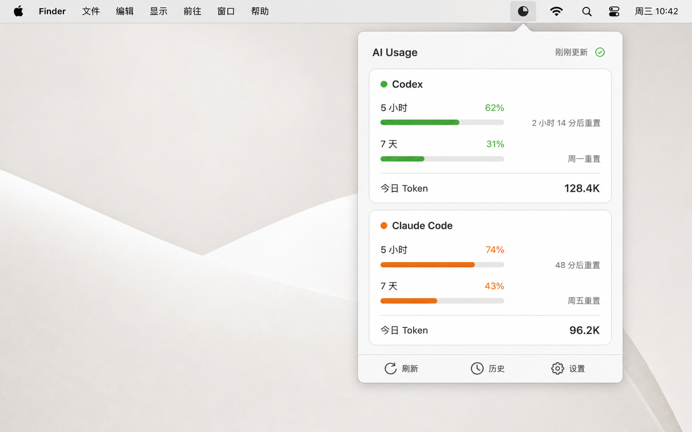
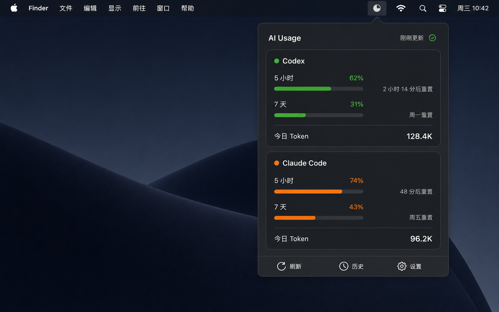

# 原型说明

## 1. 浅色模式



原型文件：[menu-bar-light.png](../assets/prototypes/menu-bar-light.png)

## 2. 深色模式



原型文件：[menu-bar-dark.png](../assets/prototypes/menu-bar-dark.png)

这是首版高保真方向稿，重点验证信息层级与尺寸感，不作为逐像素开发约束。最终界面应优先使用原生 SwiftUI 组件、系统字体和 SF Symbols。

## 3. 主题切换

设置页提供三种互斥模式：

| 模式 | 行为 |
| --- | --- |
| 跟随系统 | 默认值；继承 macOS 当前外观，并响应运行中的系统切换 |
| 浅色 | 无论系统设置如何，应用弹窗、设置页和历史窗口保持浅色 |
| 深色 | 无论系统设置如何，应用弹窗、设置页和历史窗口保持深色 |

切换后立即生效，不需要点击保存或重启应用。主题偏好在下次启动时继续保留。菜单栏图标仍由 macOS 按菜单栏环境渲染，不被应用主题强制染色。

## 4. 布局规格

| 区域 | 建议规格 |
| --- | --- |
| 弹窗宽度 | 360 pt，可在 340–380 pt 间调整 |
| 外边距 | 16 pt |
| 卡片间距 | 12 pt |
| 卡片圆角 | 10–12 pt |
| 进度条高度 | 6 pt |
| 主标题 | 15–17 pt semibold |
| 正文 | 12–13 pt |
| 辅助文字 | 11–12 pt secondary |

## 5. 交互规则

- 单击菜单栏图标打开或关闭弹窗。
- “刷新”立即检查数据变化，并在顶部显示刷新状态。
- “历史”打开独立窗口；MVP 未完成历史页时可以隐藏，而不是展示不可用按钮。
- “设置”打开原生 Settings scene。
- 点击 provider 卡片可展开 token 分类和数据来源详情。
- 指针悬停进度条时显示精确重置时间。
- 数据超过阈值时可发送本地通知，但不能仅依靠颜色表达。

## 6. 菜单栏标签

用户可选择：

```text
仅图标
C 62% · A 74%
74%（显示当前最紧张的额度）
```

当菜单栏空间不足时，依次退化为“最大百分比”与“仅图标”。

## 7. 需要补充的界面状态

正式开发时必须为每张 provider 卡片补齐：

- 正常数据。
- 等待第一次样本。
- CLI 未安装。
- Claude 集成未安装。
- 文件权限不足。
- 数据已过期。
- 当前版本格式不兼容。

## 8. 视觉原则

- 保留 macOS 原生克制感，避免网页仪表盘式的大面积装饰。
- Codex 使用绿色作为识别色，Claude Code 使用橙色；警告与错误使用系统语义色。
- 数字采用等宽数字特性，避免倒计时变化引起布局跳动。
- 深色模式使用系统材料和语义颜色，不直接反转原型中的固定 RGB。
- 深色卡片与弹窗背景保持可辨识的层级，进度条轨道、分隔线和辅助文字应符合对比度要求。
- 所有图标提供文字标签或辅助功能名称。

## 9. 原型生成说明

浅色原型通过内置图像生成方式制作，提示目标为“原生 macOS 浅色菜单栏用量监控弹窗”。深色原型以浅色图为编辑目标，仅改变 macOS 外观、系统材质与语义颜色，并保持 Codex/Claude Code 双卡片、5 小时与 7 天窗口、token 汇总及底部操作栏不变。图片仅用于视觉沟通；实现时应以本文档与项目需求中的字段和状态规则为准。
